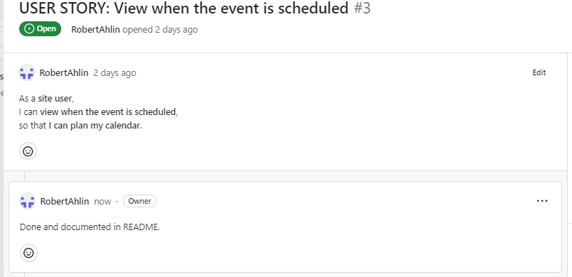

# EMX Event Management

 
(By now this ReadMe is just copied from another project to serve as a template. The content will change during the project buildup.)

<h2>Project</h2>

Welcome to this Enduro and Motocross event handler. 
This is event handler for motocross and enduro, which will forfill a real life need. There is no good event handler to create events for motocross and enduro clubs. All clubs uses thier own systems. (Everything from Google sheets and mail groups all kind of temporary solutions.) There is one event hadler for official competitions handled by SVEMO a Swedish motorsport association.

# Table of Content

- <a href="#title">EMX Event Management</a>
- <a href="#table-of-content">Table of Content</a>
- <a href="#demo">Demo</a>
- <a href="#agile">Thinking Agile</a>
- <a href="#user-experience">User Experience</a>
- <a href="#user-stories">User Stories</a>
  - <a href="#strategy">Strategy</a>
  - <a href="#scope">Scope</a>
  - <a href="#structure">Structure</a>
  - <a href="#skeleton">Skeleton</a>
  - <a href="#surface">Surface</a>
- <a href="#technologies">Technologies</a>
  - <a href="#flowshart">Flowshart</a>
- <a href="#features">Features</a>
- <a href="#finalizing">Finalizing</a>
- <a href="#more-features">More Features</a>
- <a href="#testing">Testing</a>
  - <a href="#validating">Validating</a>
  - <a href="#bugs">Bugs</a>
- <a href="#deployment">Deployment</a>
- <a href="#credits">Credits</a>
  - <a href="#acknowledgments">Acknowledgments</a>

# Demo

The live link to Heroku can be found here - <a href="https://emx-event-c84aa8e070ad.herokuapp.com/" target="_blank">https://emx-event-c84aa8e070ad.herokuapp.com/</a>

The idea for this project is to get create an event handler for motocross and enduro events. Riders can register to sign up for events. Competitions, training or other available events.

# Thinking Agile

  I'm already familaar with the agile understanding. Just 6 month ago, I got an exam from two years part time studies in an Aglie Project Managment course where most of the agile concept was covered, all from Scrum, SAFe, project owner to the legal aspects and also change management. To use the project board in Github was a new experience, as I'm use to using Miro and Trello. But fun to learn something new. Using the User Stories on the board is a nice way to keep track of what to do and see the progress. Using the board on my own is a bit strange, as for example, the iterations and iteration planning will not be applicable in the same way. But to show my knowledge I first created a backlog column where I can apply the MoSCoW principle and sort out things to do and not to do etc. Also a column for things to be tested as a way of using Defenition of Done (DoD). 
   
  
  Using the DoD column I place all implemented user stories in that column waiting to be tested. My defenition of done was to do a final test and document it in this README. Also leave a comment in the user story that it was done before move it to the done column. 
   
  Later I added a column for User Stories I choosed not to do.
  
# User Experience

The idea is to make it simple and be able to easily overview different events. 
By registering as a user, you are able to sign up for events.

## User stories

A user should:

- Be able to register as a rider
- Be able to sign up for events.
- Be able to like an event and see if other users has liked it.
- See other riders that has sined up for an event.
- See old events.
- 

### Strategy

I used the Django blog walkthrough as a base. My idea was to use the posts as a way to create events, and then use the comment function to sign up for the event. From there build more content and functions.

### Scope

This will show what I learnt with Python using Django and all things in earlier modules. 

### Structure

- Using Django and Python
- Implement Cloudinary for images to the event
- Linked to ElephantSQL to use Postages SQL
- User Summernote for a WYSIWYG editor for creating event.

### Skeleton

The skeleton is based on a Django blog. I started "emxevent" as a project and "events" as an app. From that I changed the models to fit my needs.

### Surface

What is possible to do with a text based game?
I wanted the player to experience some visual features that will happen for different event.

- First I added some ascii art. There is a dragon.
- Second, I wanted the story text to stand out from the "console text" so I found a way to colorize the text. The story text as yellow and dice rolls as blue text.

## Technologies

1. Python - to create functions for the game.
2. Django - using Django blog as a foundation.
3. Cloudinary - to host images.
4. Summernote - to apply a wysiwyg editor.

## Flowshart

 

- Game start with a short preface for the game and also explaining some game commands.
- Player enter their name and create a simple character.
- Role-playing game start to get a story block from a Google Sheet.
- After each text block the player is asked to continue.
- The text block is checked for two different ending phrases.
- If a text block ends with the phase "Time to roll your dice" the player will be asked to roll.
  - From each of the dice roll event there will be three different scenarios. Then a player is asked continue.
  - The game continue to the main story efter the scenario from the dice roll event.
- If a text block end whith the phrase "The end!" that will trigger the ending sequense where player is asked to confirm game end.
- Game will reboot.

## Features

<h3>Existing Features</h3>

<b>View event date:</b> 
On the index page for each event, it is possible to see when the event will happen. 
 

<b>Events sorted by event date:</b> 
On the index page the events are sorted with the next upcoming event first. 
 

<b>Page for old events</b> 
Adding more events over time would soon fill the event page with a lot of events. And I didn't want to have all the event saved. I first thought of making a delete function. But I also thought that both event creators and users might want to se when the event was and who participated. So I made a new page for old events. And on the index page I added a date sorting function that only showed event with a date in the futere. I copied index.html to old_event.html and changed the date sorting function to only show event with an event date prior to today. 
 

<b>Footer:</b> 
The footer of the page contains links to external social sites and a live timing applaction. (All sites are in Swedish). 
 

<h3>Error handling</h3>

The app has error handling for:

- Not be able to use an existing start number when signing up for an event.
- 

## Finalizing

A screenshot form the game running in Heroku console. 
 

## More Features?

I can actually think of a lot of things to implement to this.

- Permit selected users to create events.
- Implent emailing functions. Such as
  - Send an authentication link when signing up.
  - Send a password reset link.
- Save a riders transponder number in the user information.
- 

## Testing

Through the developing of the EMX Events I had various challanges.
I followed the "I think, therefore I blog" walkthrough to set it up and use that blog as a base and then changed to my needs. At one part everything just fell apart. The Admin user interface stopped working. When logged in as an admin it showed nothing. Trying to fix it, it kind of went downhill from there. So I started over from scratch in a new repo and a new workspace and copied code piece by piece untill I was on track again. This will explain why the user stories in the project board are linked to two different repos.

I decided from the beginning that I should make sure to test everything I do. So from the first runnable skeleton of the project. I made sure it was working on Heroku by doing an early deploy. Through the whole process of developing the EMX Events app I hade it running with `python3 manage.py runserver` and checked that all was working about when I did each commit.

- Allauth: `../.pip-modules/lib/` doesn't work in Codeanywhere. It gives: `ls: cannot access '../.pip-modules/lib/': No such file or directory` the solution was found in Slack and I used this command instead: `cp -r /home/codeany/.local/lib/python3.9/site-packages/allauth/templates/* ./templates/.`
   
Please click on each test below to se details:    

Create an event with image upload.

1. In the Admin panel I clicked the "+Add" button to start creating an event. I added an image to also test that the Cloudinary API works. 
 
2. As shown in the image, I saved it as a draft first to test that function. I made sure the event wasn't visible on the index page. 
 
3. I went back to the Admin panel and opened the event and set it to "Active" and saved it. 
 
4. Finally I made sure it appear on the index page and that I could click on it to see event details. 
 

Sign up for event. Manual testing to sign up for an event.

1. In the event_detail.html page I entered values for First name, Last name, Start number and Transponder. Then clicked on submit. 
 
2. I get a message that it was successful and that it is now waiting for approval. 
 
3. Logging in to the admin panel I see that the sign up is waiting for approval. 
 
4. Logged in as an Admin I approved the sign up. 
 
 
5. Going back to the site I now confirm that it is approved and showing up in the list. 
 
6. When viewing old events details it is not possible to sign up. The sign up form will automatically be disabled when the date for the event has passed. 
 

<h3>Error handling for sign up</h3>
1. Testing <b>not</b> to fill in the First name or Last name will result in a warning since those fields are required. 
 
2. The start number needs to be unique so there is an error handling for that. However the field is accepted as empty. 
 
3. If the user try to use a number that has been taken. The field will be cleared and a warning will appear when changing field. 
 

Events with an event date that passed today date.

Filtering out events on event_date prior to todays date didn't work at all first using this line of code: 
`` 
To test it I added this line to print the results to the browser:  `{{ event.event_date }} | {{ today }}` 
in the browser it showed: "Nov. 8, 2023 | 2023-11-09" 
I understood that the format was not same of the two dates. The solution that finally worked is:  `` 
Once I got it working I did events to make sure the function worked. 
As shown in the image below I just created an event. 
 
The event got a event date prior to today. (When I did the test it was 2023-11-10) 
 
On the website it is possible to click "Old Events" to get a view over events that has an event date before todays date.
 

### Validating

I googled for any PEP8 and Python code validators, but could not find anyone working. I think I tried like five or six different. Some just threw errors on the API credentials and some didn't work at all. After spending some time to find a validator that worked I gave up. I relying on my telling me that it looked nice.

### Bugs?

I haven't really encountered any bugs in this project. 
I got stuck several times in order to figure out different things but that is all about learning.

## Deployment

The site was deployed to Heroku. Using the Code institute guidence from Love Sandwiches walkthrough.

- I used the GitHub template to create my own repository.
- Used Codeanywhere as IDE.
- Made a Google sheet and set up the API according to the videos in the Love Sandwiches walkthrough.
- I deployed the project to Heroku going through these steps.
    1. Create new app.
    2. Named it: rpg-p3 (Short for Role Playing Game - Project 3).
    3. Choose Europe as region.
    4. I went to the Settings tab to create config vars for CREDS and PORT.
    5. I added the buildpacks Python and Nodejs.
    6. In the Deploy tab I connected to GitHub repository "rpg-p3".
    7. I manually deployed branch (main).

I have in two occations experienced that Heroku stopped working and I had to redeploy branch. Seems like there is some time of timelimit?
I truly do hope that it is still running when it is time for review.
Otherwise just slack me (Robert Ahlin) and I will redeploy again.

## Credits

- I Think, Therefore I Blog - The base foundation for the skeleton setup from this walkthrough.
- Google search engine is frequently used. It's hard to remember how to write codes.
- A lot of help comes from search hits at the "stack overflow" forums.
- <a href="<https://djangocentral.com/authentication-using-an-email-address/" target="_blank">Djangocentral</a> - Code examples and help.
- ChatGPT - While exploring the endless possibilies using ChatGPT I have used this to troubleshoot and ask for help for code snippets.
- <a href="https://learndjango.com/" target="_blank">https://learndjango.com/</a> - to set up the password reset function. There will be no mail sent as I've choosed not to implement a SMTP engine in this scope.
- Using <a href="https://www.online-spellcheck.com/" target="_blank">https://www.online-spellcheck.com/</a> for spelling.

### Acknowledgments

- Thanks to my fiancé for supporting me when I get stuck.
