# EMX Event Management

<h2>Project 4 - EMX Events</h2>

Welcome to this Enduro and Motocross event handler. 
This is event handler for motocross and enduro, which will forfill a real life need. There is no good event handler to create events for motocross and enduro clubs. All clubs uses their own systems. (Everything from Google sheets and mail groups all kind of temporary solutions.) There is one event handler for official competitions handled by SVEMO the Swedish motor sport association.
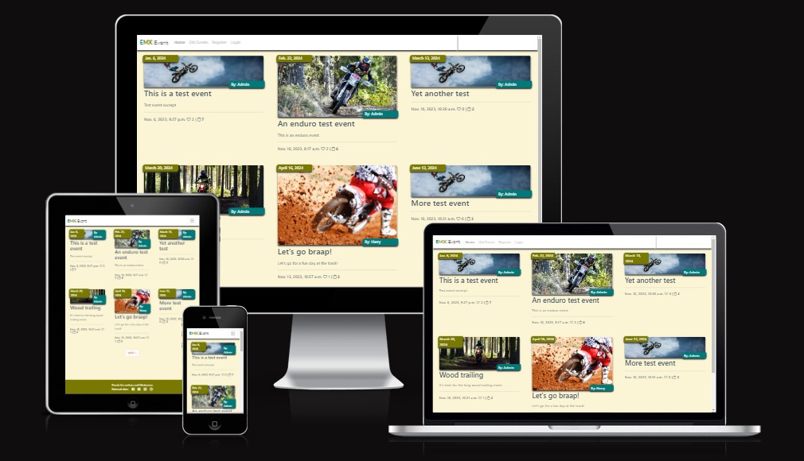 

# Table of Content

- <a href="#title">EMX Event Management</a>
- <a href="#table-of-content">Table of Content</a>
- <a href="#demo">Demo</a>
- <a href="#agile">Thinking Agile</a>
- <a href="#user-experience">User Experience</a>
- <a href="#user-stories">User Stories</a>
  - <a href="#strategy">Strategy</a>
  - <a href="#scope">Scope</a>
  - <a href="#structure">Structure</a>
  - <a href="#skeleton">Skeleton</a>
  - <a href="#surface">Surface</a>
- <a href="#technologies">Technologies</a>
- <a href="#features">Features</a>
  - <a href="#navbar">Navigation bar</a>
  - <a href="#view-event-date">View event date</a>
  - <a href="#events-sorted">Events sorted by event date</a>
  - <a href="#old-events">Page for old events</a>
  - <a href="#likes">Likes</a>
  - <a href="#signed-up">Signed up</a>
  - <a href="#edit-sign-up">Edit sign up</a>
  - <a href="#delete-sign-up">Delete sign up</a>
  - <a href="#footer">Footer</a>
  - <a href="#crud">CRUD</a>
  - <a href="#error-handling">Error handling</a>
- <a href="#finalizing">Finalizing</a>
- <a href="#more-features">More Features</a>
- <a href="#testing">Testing</a>
  - <a href="#validating">Validating</a>
  - <a href="#bugs">Bugs</a>
- <a href="#deployment">Deployment</a>

# Demo

The live link to Heroku can be found here - <a href="https://emx-event-c84aa8e070ad.herokuapp.com/" target="_blank">https://emx-event-c84aa8e070ad.herokuapp.com/</a>

The idea for this project is to get create an event handler for motocross and enduro events. Riders can register to sign up for events. Competitions, training or other available events.

# Thinking Agile

Link to board: <a href="https://github.com/users/RobertAhlin/projects/8/views/1" target="_blank">RobertAhlin's EMX Project Board</a>

I'm already familiar with the agile understanding. Just 6 month ago, I got an exam from two years part time studies in an Agile Project Managment course where most of the agile concept was covered, all from Scrum, SAFe, project owner to the legal aspects and also change management. To use the project board in Github was a new experience, as I'm use to using Miro and Trello. But fun to learn something new. Using the User Stories on the board is a nice way to keep track of what to do and see the progress. Using the board on my own is a bit strange, as for example, the iterations and iteration planning will not be applicable in the same way. But to show my knowledge I first created a backlog column where I can apply the MoSCoW principle and sort out things to do and not to do etc. Also a column for things to be tested as a way of using Defenition of Done (DoD).  Later I added a column for User Stories I choose not to do. 
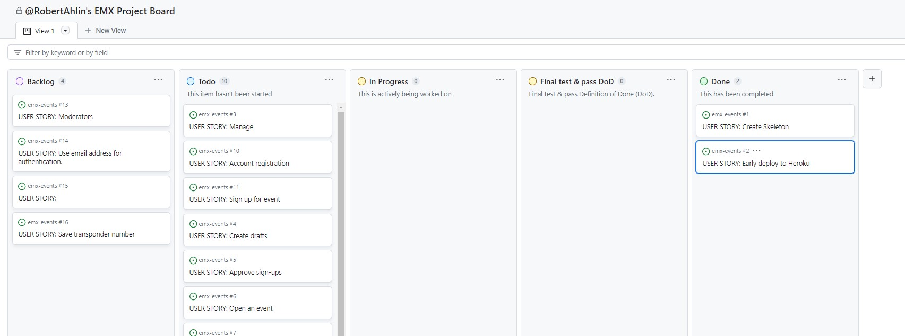 

Using the DoD column I place all implemented user stories in that column waiting to be tested. My defenition of done was to do a final test and document it in this README. I also added checkboxes for task and to define the DoD. Also leave a comment in the user story that it was done before move it to the done column. I also used labels when applicable. 
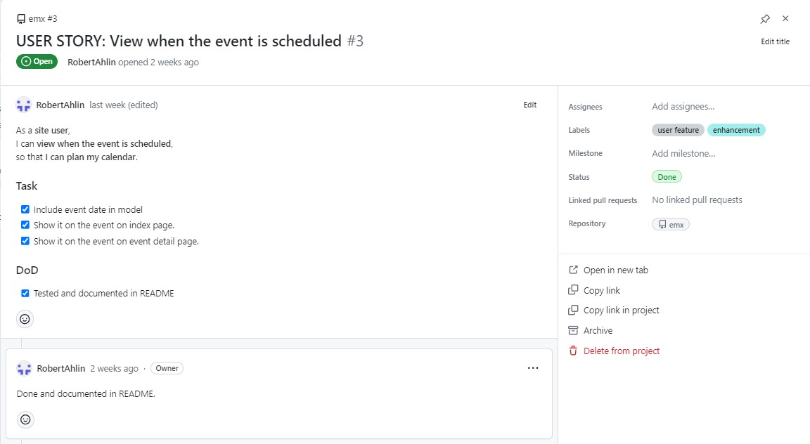 

Here is just an image from when I was about to come to the end of my project. 
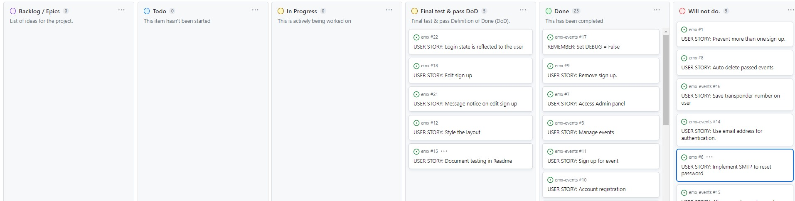   
  
# User Experience

The idea is to make it simple and be able to easily overview different events. 
By registering as a user, you are able to sign up for events.
When the sign up is approved. It's possible to view in the event details. And if the user is logged in, they are able to delete or edit the sign up.

## User stories

A user should:

- Be able to register as a rider
- Be able to sign up for events.
- Be able to edit their own sign up.
- Be able to delete their own sign up.
- Be able to like an event and see if other users has liked it.
- See other riders that has been approved for an event.
- See old events.

### Strategy

I used the Django blog walkthrough as a base. My idea was to, instead of posts, create events, and then skip the comments and instead make a model for signing up for the event. From there build more content and functions. 

### Scope

This will show what I learnt with Python using Django and all things in earlier modules. 
Also with feedback from previous portfolio projects, do a lot of testing and document it.

### Structure

- Using Django and Python
- Implement Cloudinary for images to the event
- Linked to ElephantSQL to use Postges SQL
- User Summernote for a WYSIWYG editor for creating event.

### Skeleton

The skeleton is based on a Django blog. I started "emxevent" as a project and "events" as an app. From that I created the models to fit my needs.

### Surface

I see a lot of potential on this event managment app. I really had to put aside ideas I had not to make this project to big. You can read some of the ideas in the "<a href="#more-features">More Features</a>" section in this README.

I really like the rounded corner and shadow effect to get the website more three dimensional. As well as both the navigation bar and each event, but also messages and other small things. This will make each part stand out a bit more.

## Technologies

1. Python - to create back end function.
2. HTML and CSS - for the front end.
3. Django - using Django as a foundation.
4. Cloudinary - to host images.
5. Summernote - to apply a wysiwyg editor.
6. Bootstrap - for design.

# Features

## Existing Features

### <b>Navigation bar</b>
On top of the page is the navigation bar. The "EMX|Event" logo is clickable and as "Home" it will also link to the landing page. Next to it is a link to "Old Event". It is explained later in this feature section. Next is "Login" if the visitor is not logged in as a user. 
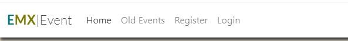 
If the user is logged in, the Login will change to "Logout". 
Also, if the logged in user has "staff status" the user can add an event where the link "Add Event" will appear and will link directly to the add event panel. 
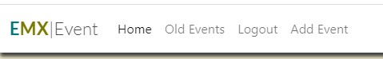 

### <b>Logged in as</b>
When developing the site I wonder which user I had logged in with. So I thought it would be a nice feature to show who is logged in when logged in. So I added this little feature to the top right corner. 
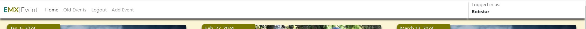 
Also, if the user is a staff. The username is clickable and will open the "Admin panel" in a new page. 
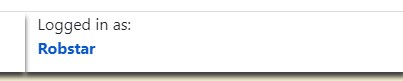 

### <b>Notification Messages</b>
Messages for different notifications will appear in the top right corner fitted to the height of the navigation bar. 
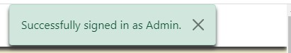 
Messages will appear for:
- Logged in
- Logged out
- Signed up to an event
- Edited sign up
- Deleted sign up

### <b>View event date:</b>
On the index page for each event, it is possible to see when the event will happen. 
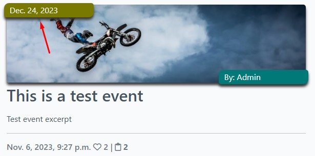 

### <b>Events sorted by event date:</b>
On the index page the events are sorted with the next upcoming event first. 
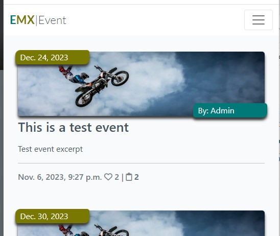 

### <b>Page for old events</b>
Adding more events over time would soon fill the event page with a lot of events. And I didn't want to have all the events saved. I first thought of making a delete function. But I also thought that both event creators and users might want to see when the event was and who participated. So I made a new page for old events. I copied index.html to old_event.html and added date sorting functions to respective view to after and before today's date. 
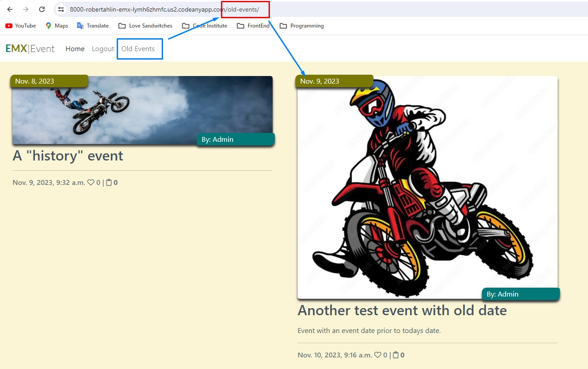 
When viewing details of an old event. It is longer possible to sign up for the event. This is also notified through an active alert message:
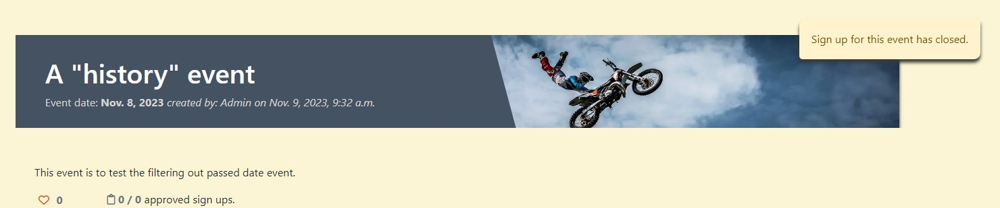 

### <b>Likes</b>
I kept the function to like an event. First I thought of removing it as it seemed quite unnecessary to like an event. But for educational purpose I kept it. Also it will give a hint of if it is an event is popular. 
View total likes: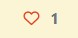 Liked by user: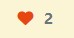 

### <b>Signed up</b>
On the index page is it possible to see how many has signed up for the event. 
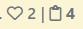 
When looking at the details of the event. It shows how many has been approved and how many has signed up in total for this event. 
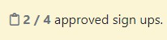 

### <b>Edit sign up</b>
If you're logged in a user, viewing the details of an event and you have an approved sign up. There is an option to edit the sign up. 
Next to your sign up is a blue icon for edit your sign up. 
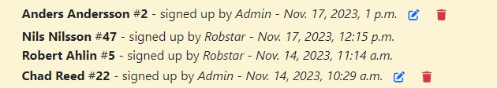 
Click on the edit icon to open the sign up data in a new form. Here the user can edit first name, last name and transponder number. But not the start number. As the start number is concidered to be set when the sign up is approved the user can not edit it. Cause in real life this start number will be locked in to the official start list to identify the rider. The "Cancel" button will just take the user back in browser's history one step. Eg. to the event that was previously viewed. 
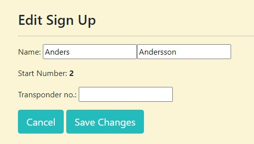 
When saving changes. The form will update the sign up and give the user a message of success. 
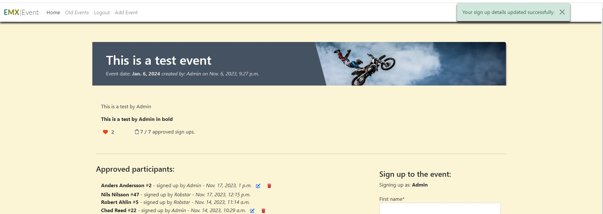 

### <b>Delete sign up</b>
If you're logged in a user, viewing the details of an event and you have an approved sign up. There is an option to delete the sign up. 
To the right of the edit icon on the sign up is an icon to delete the sign up. 
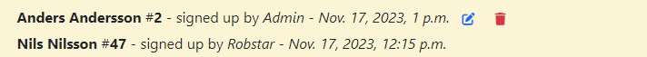 
When clicking it, a button to confirm the delete will appear to prevent missclicks and unwanted deletions. Hovering the button will make it more colorful to really make the user aware of what is happening. 
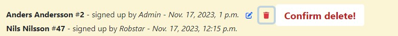 
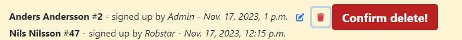 

### <b>Footer</b>

The footer of the page contains links to external social sites and a live timing applaction. (All sites are in Swedish). 
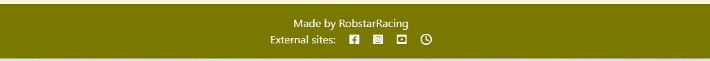 

## CRUD
The above features include the Create, Read, Update and Delete functions in the front end. As a user you can.
- <b>C</b>reate - Sign up for an event.
- <b>R</b>ead - View a list of approved participants.
- <b>U</b>pdate - Edit your sign up.
- <b>D</b>elete - Delete the sign up.

## Error handling

The app has error handling in UI:

- First and Last name required when signing up.
- Not be able to use an existing start number when signing up for an event.

## Finalizing

A screenshot from my browser. 
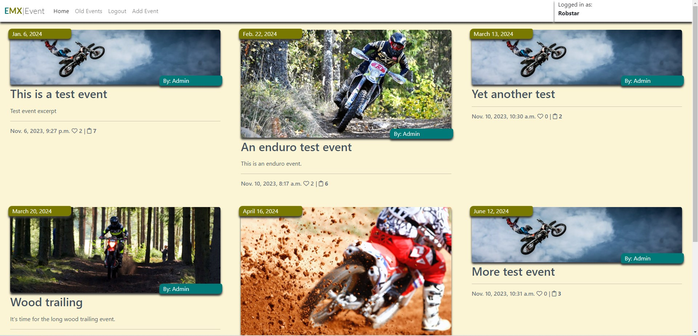 

 

## More Features?

I can actually think of a lot of things to implement to this.

- Implement emailing functions. Such as
  - Send an authentication link when signing up.
  - Send a password reset link.
- Save a riders transponder number in the user information.
- Categorize the events. Like "Enduro" or "Motocross".
- Make a comma separated csv file from list of the sign ups to be able to transfer it to a timing application.
- More visual styling. Like instead of opening the edit of a sign up on new page. Open it in a "hovering" form in the event detail page.

## Testing

Through the developing of the EMX Events I had various challanges.
I followed the "I think, therefore I blog" walkthrough to set it up and use that blog as a base and then changed to my needs. At one part everything just fell apart. The Admin user interface stopped working. When logged in as an admin it showed nothing. Trying to fix it, it kind of went downhill from there. So I started over from scratch in a new repo and a new workspace and copied code piece by piece until I was on track again. This will explain why the user stories in the project board are linked to two different repos.

I decided from the beginning that I should make sure to test everything I do. So from the first runable skeleton of the project. I made sure it was working on Heroku by doing an early deploy. Through the whole process of developing the EMX Events app I had it running with `python3 manage.py runserver` and checked that all was working about when I did each commit.

   
Please click on each test below to see details:

Register as a user.

To test to register as a user I:
1. Clicked Register in the navigation bar: 
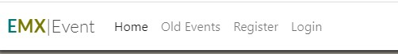 
2. Filled in the form with a username and password. 
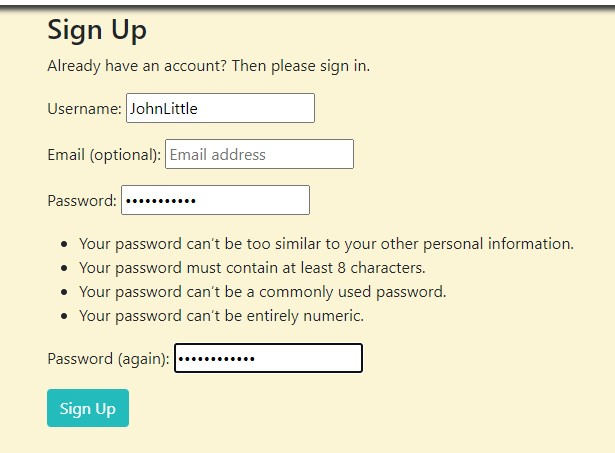 
3. Finally when rigistration has been submitted the user gets logged in and an alert will appert to notify the user. 
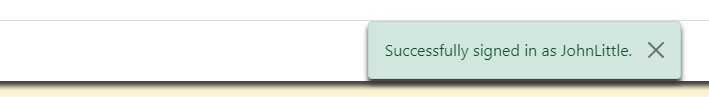 

Create an event with image upload.

1. In the Admin panel I clicked the "+Add" button to start creating an event. I added an image to also test that the Cloudinary API works. 
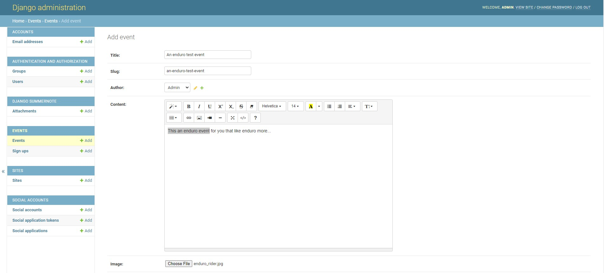 
2. As shown in the image, I saved it as a draft first to test that function. I made sure the event wasn't visible on the index page. 
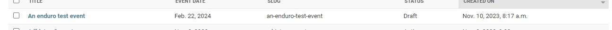 
3. I went back to the Admin panel and opened the event and set it to "Active" and saved it. 
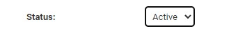 
4. Finally, I made sure it appears on the index page and that I could click on it to see event details. 
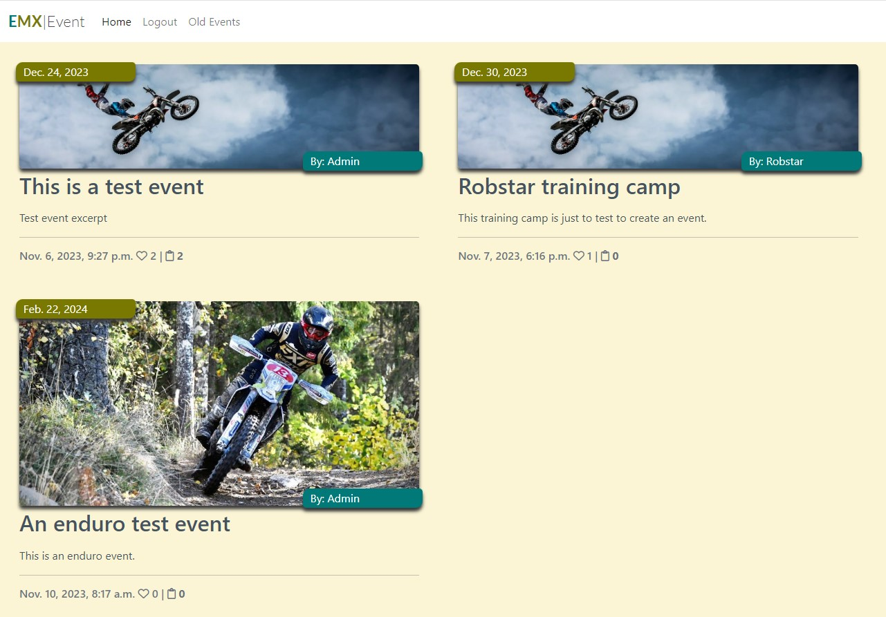 
- When I started to create more events and more sign ups to events I soon discovered that the sign ups didn't register in the database. Trying to troubleshoot I soon discovered that the issue was that start_number in my model had `unique=True`. My original thought was that each sign up should have a unique start number related for each event. But as the database will check for all start numbers in all events, it was not possible to use the same start number in different events. I solved it by just remember the `unique=True` line in the model.

Sign up for event. Manual testing to sign up for an event.

1. In the event_detail.html page I entered values for First name, Last name, Start number and Transponder. Then clicked on submit. 
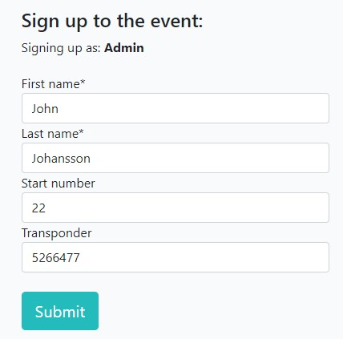 
2. I get a message that it was successful and that it is now waiting for approval. 
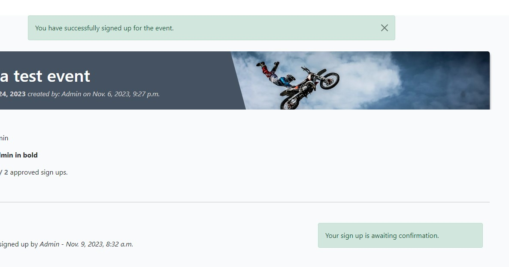 
3. Logging in to the admin panel I see that the sign up is waiting for approval. 
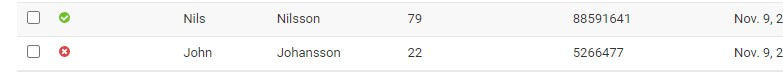 
4. Logged in as an Admin I approved the sign up. 
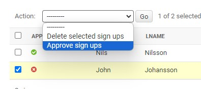 
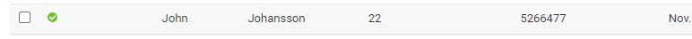 
5. Going back to the site I now confirm that it is approved and showing up in the list. 
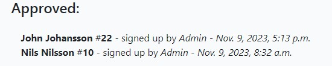 
6. When viewing old events details it is not possible to sign up. The sign up form will automatically be disabled when the date for the event has passed. 
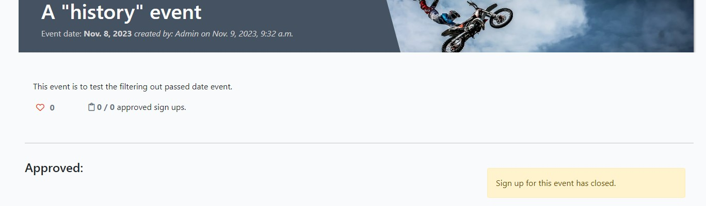 
<h3>Error handling for sign up</h3>
1. Testing <b>not</b> to fill in the First name or Last name will result in a warning since those fields are required. 
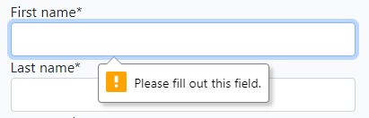 
2. The start number needs to be unique so there is an error handling for that. However the field is accepted as empty. 
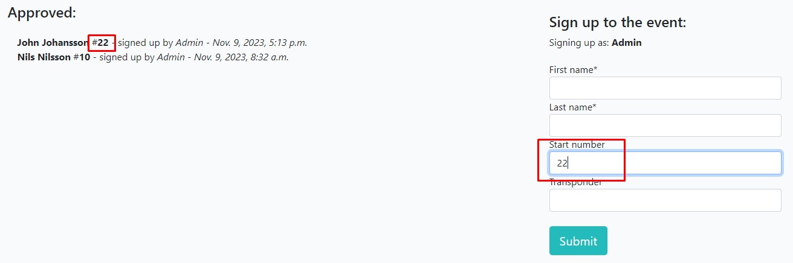 
3. If the user try to use a number that has been taken. The field will be cleared and a warning will appear when changing field. 
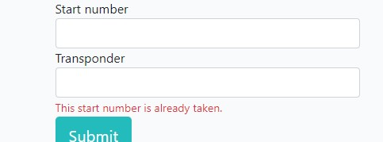 

Edit a sign up

I logged in a user, viewed the details of an event and made sure the user I used had an approved sign up. 
Next to the sign up is an icon to edit a sign up. I clicked it. 
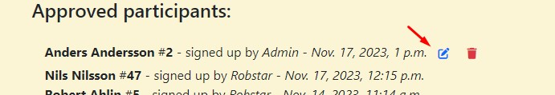 
I then come to this edit sign up page. 
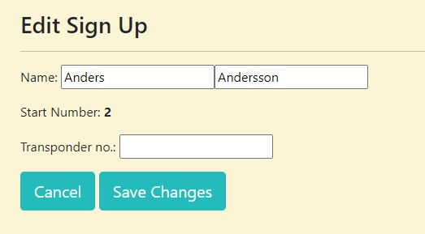 
I removed one "s" from the last name and added a transponder number and clicked Save changes. 
 
I got redirected back to the event where I get a message that the sign up has been updated. Also, I see now that the last name only has one "s". 
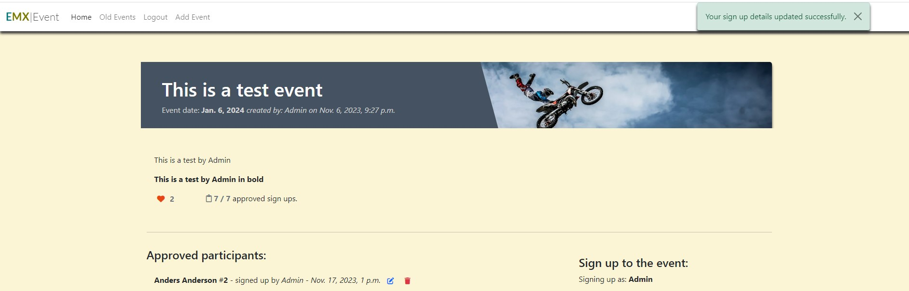 

Deleting a sign up

I logged in a user, viewed the details of an event and made sure the user I used had an approved sign up. 
Next to the sign up is an icon to delete it 
 
When clicking the icon. The words "Confirm delete!" appear to make sure the deletion is not a missclick. 
 
After clicking "Confirm delete!". A success message of deleting the sign up appear, containing the name of the person in the deleted sign up. 
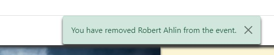 
When looking in the approved sign up list. The sign up is gone. 
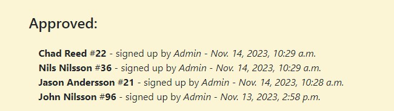 

Events with an event date that passed today date.

This is a small story on itself. Filtering out events on event_date prior to today's date didn't work at all first using this line of code: 
`` 
To test it I added this line to print the results to the browser:  `{{ event.event_date }} | {{ today }}` 
in the browser it showed: "Nov. 8, 2023 | 2023-11-09" 
I understood that the format was not same of the two dates. The solution that finally worked is:  `` 
But when I added more events I discovered that the "for event in event_list" loop generated empty entries rather than remove them. Here I got the help from ChatGPT that came up with the solution to filter it out in the view before passing the data to the template. 
def get_queryset(self): 
        today = timezone.now().date() 
        return Event.objects.filter(status=1, event_date__gte=today).order_by('event_date')  
Once I got it working I did events to make sure the function worked. 
As shown in the image below I just created an event. 
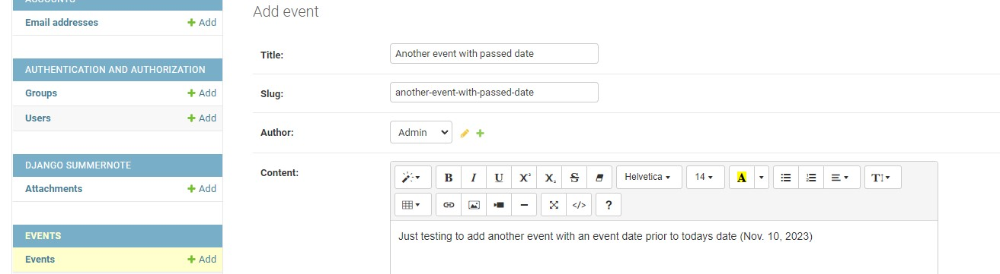 
The event got a event date prior to today. (When I did the test it was 2023-11-10) 
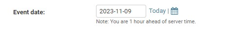 
On the website it is possible to click "Old Events" to get a view over events that has an event date before today's date.
 

Pagination

I added events to make sure I had enough to activate the pagination function to verify that it works. 
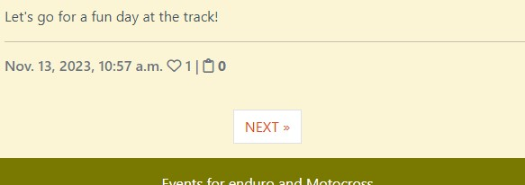 

I used Lighthouse in Chrome browser. It showed I had some accessibility issues with contrast for text color compared to background color. It was some bootstrap classes that I either removed or made custom color in style.css to get the accessibilty to green. 
the I also tried to work with the Performance, but it was because of larged images being uploaded for the events and server response time. So for the future I'll keep that in mind trying to use smaller images. 
Results after I fixed the suggested issues.
 

### Validating

When I started to validate my code I got a lot of errors to begin with. Most of them where about "white spaces" that I couldn't do anything about.  I talked about it with my mentor, and he said it's because of the mix of python in the html code. So to be able to validate the html is removed all the {{ tags }} and  to get clean html. So I validated the code by pasting it in to the validators.  
Later I just started to hide python tags in filters. 

HTML Validating: 
base.html 
 

index.html 
 

event_detail.html 
 

old_event.html 
 

CSS Validating: 
style.css 
 

PEP8 Validating: 
models.py 
 

settings.py 
 

emxevents/urls.py 
 

emx/urls.py 
 

veiws.py 
 

I couldn't find solutions to some of the "line too long" issues. But asking around, I soon understood that it can't always be fixed.

### Bugs?

I haven't really encountered any bugs in this project. Just a couple of small problems. 
Most of it was that I got stuck several times in order to figure out different things but that is all about learning.

## Deployment

The site was deployed to Heroku. Using the Code institute guidence from "I think, therefore I blog" walkthrough.

- I used the GitHub template to create my own repository.
- Used Codeanywhere as IDE.
- I deployed the project to Heroku going through these steps.
    1. Create new app.
    2. Named it: emx (Short for Enduro MotoCross).
    3. Choose Europe as region.
    4. I went to the Settings tab to create config vars for:
        - Cloudinary url
        - Database url
        - Port
        - Secret key
    5. In the Deploy tab I connected to GitHub repository "emx".
    7. I manually deployed branch (main).

## Credits

- I Think, Therefore I Blog - The base foundation for the skeleton setup from this walkthrough.
- Google search engine is frequently used. It's hard to remember how to write codes.
- A lot of help comes from search hits at the "stack overflow" forums.
- ChatGPT - While exploring the endless possibilities using ChatGPT I have used this to troubleshoot and ask for help for code snippets.
- <a href="https://learndjango.com/" target="_blank">https://learndjango.com/</a> - to set up the password reset function. There will be no mail sent as I've choose not to implement a SMTP engine in this scope.
- Using <a href="https://www.online-spellcheck.com/" target="_blank">https://www.online-spellcheck.com/</a> for spelling.
- Images from https://www.pexels.com, https://www.svemo.com, <https://stock.adobe.com/>

## <a id="acknowledgements">Acknowledgement</a>

- I've been struggeling with Codeanywhere as an editor. By the end of my project 18-20 Nov. they had an scheduled downtime. After it came back up it worked fine for the first day. But on the 21st Nov. something happened. When I ran server (python3 manage.py runserver) and viewing my site on "https://8000-robertahlin-emx-lymh6zhmfc.us2.codeanyapp.com/" it only loaded an old version of my style.css. All the changes I made during the 20th Nov wasn't applied even though it was still saved in my style.css file. I tried to restart my workspace, even closing the browser and restart but it didn't work. But when deploying to Heroku it all worked fine. Since I was about to finish I didn't try more to solve it.
